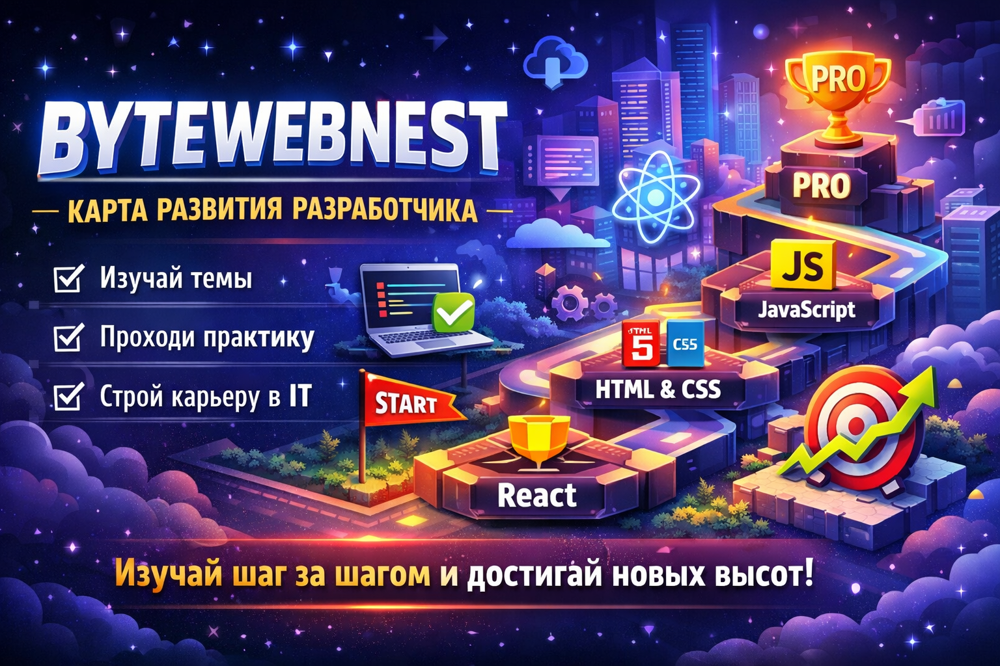

# BYTEWEBNEST

## Interactive roadmap for web developers

BYTEWEBNEST — это интерактивная карта развития веб‑разработчика.
Сайт показывает системную структуру изучения JavaScript и веб‑разработки от базовых тем до более сложных уровней.

Каждый модуль включает:
- темы обучения
- ключевые объяснения
- практику для закрепления
- итоговые выводы

Цель проекта — создать **понятную и логичную систему обучения**, чтобы не изучать технологии хаотично.

---

## Что включает курс

BYTEWEBNEST содержит:

- структурированную roadmap обучения
- модули обучения
- теорию + практику
- постепенное развитие навыков
- навигацию по темам и уровням

---

## Доступ к курсу

BYTEWEBNEST — платный образовательный проект.

Полный доступ ко всем материалам стоит:

**10 USD**

Оплата помогает поддерживать разработку курса и добавление новых модулей.

---

## Получить доступ

Для получения доступа напиши в Telegram:

**@bytewebnest**

https://t.me/bytewebnest

---

## Технологии проекта

Проект построен на:

- HTML
- CSS
- JavaScript
- JSON
- GitHub Pages

---

## Запуск проекта локально

Чтобы JSON файлы корректно загружались через `fetch()`, сайт нужно запускать через локальный сервер.

Можно использовать:

- VS Code Live Server
- Python server
- Open Server Panel
- любой локальный dev server

---

## Размещение на GitHub Pages

1. Создай репозиторий (например `bytewebnest`)
2. Загрузи все файлы проекта
3. Открой `Settings → Pages`
4. Выбери `Deploy from branch`
5. Укажи ветку `main`

После этого сайт будет доступен по адресу:

https://admin-bytewebnest.github.io/bytewebnest-roadmap/

Не забудь заменить `username` на свой GitHub username.

---

## Структура проекта

bytewebnest/
│
├ index.html
├ css/style.css
├ js/app.js
├ data/content.json
├ data/module-status.json
├ images/
├ partials/
├ robots.txt
├ sitemap.xml
└ README.md

---
JavaScript roadmap
Frontend roadmap
Learn JavaScript
Frontend learning path
Programming roadmap

## Авторские права

Материалы курса защищены авторским правом.
