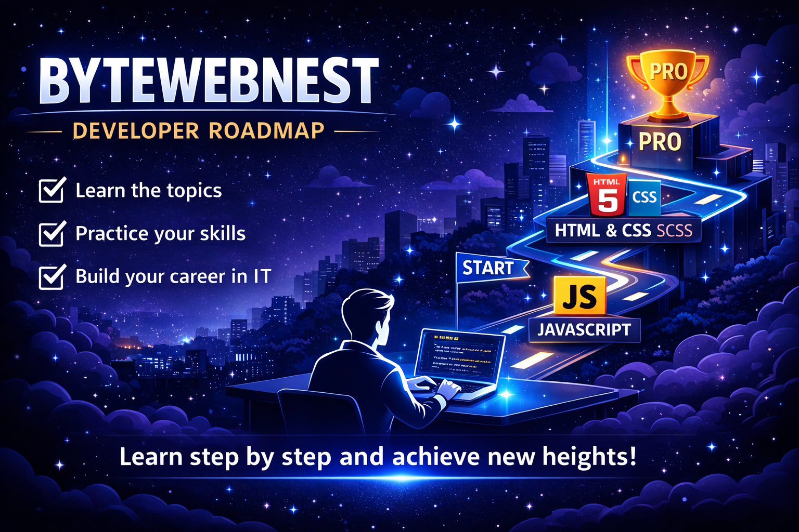

# BYTEWEBNEST

**Interactive roadmap for web developers**

English \| Русский \| Українська

------------------------------------------------------------------------

# 🇬🇧 English

## About the Project

BYTEWEBNEST is an interactive roadmap designed for web developers.

The project provides a structured learning path for JavaScript and
modern web development --- from fundamental concepts to more advanced
levels.

Each module includes:

-   learning topics
-   key explanations
-   practical exercises
-   final conclusions and outcomes

The goal of the project is to create a **clear and logical learning
system**, so developers can avoid studying technologies in a chaotic
way.

------------------------------------------------------------------------

## Course Content

BYTEWEBNEST includes:

-   a structured development roadmap
-   learning modules
-   theory + practice
-   progressive skill development
-   navigation by topics and levels

------------------------------------------------------------------------

## Course Access

BYTEWEBNEST is a paid educational project.

Full access to the course materials costs:

**10 USD**

Payments support the continued development of the course and the
creation of new modules.

------------------------------------------------------------------------

## Get Access

To get access, contact via Telegram:

**@bytewebnest**

https://t.me/bytewebnest

------------------------------------------------------------------------

## Technologies

The project is built using:

-   HTML
-   CSS
-   JavaScript
-   JSON
-   GitHub Pages

------------------------------------------------------------------------

## Run the Project Locally

To correctly load JSON files using `fetch()`, the project must be run
through a local server.

You can use:

-   VS Code Live Server
-   Python server
-   Open Server Panel
-   any local development server

------------------------------------------------------------------------

## Deploy on GitHub Pages

1.  Create a repository (for example `bytewebnest`)
2.  Upload all project files
3.  Open `Settings → Pages`
4.  Select `Deploy from branch`
5.  Choose the `main` branch

After that the site will be available at:

https://admin-bytewebnest.github.io/bytewebnest-roadmap/

------------------------------------------------------------------------

## Project Structure

bytewebnest/

├ index.html\
├ css/style.css\
├ js/app.js\
├ data/content.json\
├ data/module-status.json\
├ images/\
├ partials/\
├ robots.txt\
├ sitemap.xml\
└ README.md

------------------------------------------------------------------------

JavaScript roadmap\
Frontend roadmap\
Learn JavaScript\
Frontend learning path\
Programming roadmap

------------------------------------------------------------------------

## Copyright

Course materials are protected by copyright.

------------------------------------------------------------------------

# 🇷🇺 Русский

## О проекте

BYTEWEBNEST --- это интерактивная карта развития для веб‑разработчиков.

Проект показывает структурированный путь изучения JavaScript и
веб‑разработки --- от базовых тем до более сложных уровней.

Каждый модуль включает:

-   темы обучения
-   ключевые объяснения
-   практику
-   итоговые выводы

Цель проекта --- создать **понятную и логичную систему обучения**, чтобы
не изучать технологии хаотично.

------------------------------------------------------------------------

## Что включает курс

BYTEWEBNEST содержит:

-   структурированную roadmap обучения
-   модули обучения
-   теорию + практику
-   постепенное развитие навыков
-   навигацию по темам и уровням

------------------------------------------------------------------------

## Доступ к курсу

BYTEWEBNEST --- платный образовательный проект.

Полный доступ ко всем материалам стоит:

**10 USD**

Оплата помогает поддерживать разработку курса и добавление новых
модулей.

------------------------------------------------------------------------

## Получить доступ

Напишите в Telegram:

**@bytewebnest**

https://t.me/bytewebnest

------------------------------------------------------------------------

## Технологии проекта

Проект построен на:

-   HTML
-   CSS
-   JavaScript
-   JSON
-   GitHub Pages

------------------------------------------------------------------------

## Запуск проекта локально

Чтобы JSON‑файлы корректно загружались через `fetch()`, сайт необходимо
запускать через локальный сервер.

Можно использовать:

-   VS Code Live Server
-   Python server
-   Open Server Panel
-   любой локальный dev server

------------------------------------------------------------------------

## Размещение на GitHub Pages

1.  Создайте репозиторий (`bytewebnest`)
2.  Загрузите все файлы проекта
3.  Откройте `Settings → Pages`
4.  Выберите `Deploy from branch`
5.  Укажите ветку `main`

После этого сайт будет доступен по адресу:

https://admin-bytewebnest.github.io/bytewebnest-roadmap/

------------------------------------------------------------------------

# 🇺🇦 Українська

## Про проєкт

BYTEWEBNEST --- це інтерактивна карта розвитку для веброзробників.

Проєкт показує структурований шлях вивчення JavaScript і веброзробки ---
від базових тем до складніших рівнів.

Кожен модуль містить:

-   теми навчання
-   ключові пояснення
-   практику
-   підсумкові висновки

Мета проєкту --- створити **зрозумілу та логічну систему навчання**, щоб
не вивчати технології хаотично.

------------------------------------------------------------------------

## Що містить курс

BYTEWEBNEST містить:

-   структуровану roadmap навчання
-   навчальні модулі
-   теорію + практику
-   поступовий розвиток навичок
-   навігацію за темами та рівнями

------------------------------------------------------------------------

## Доступ до курсу

BYTEWEBNEST --- платний освітній проєкт.

Повний доступ до всіх матеріалів коштує:

**10 USD**

Оплата допомагає підтримувати розвиток курсу та створення нових модулів.

------------------------------------------------------------------------

## Отримати доступ

Напишіть у Telegram:

**@bytewebnest**

https://t.me/bytewebnest
